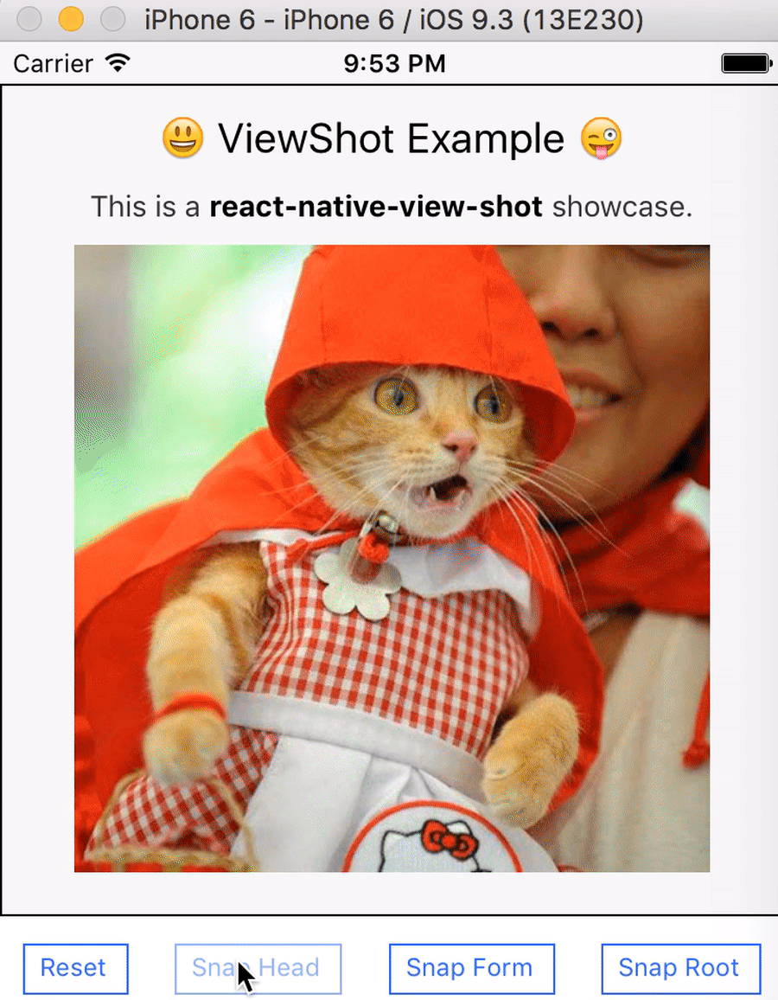
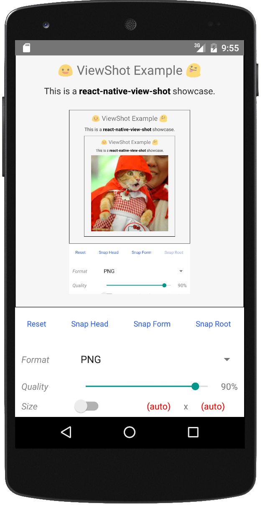

## react-native-view-shot-example

Example for [react-native-view-shot](https://github.com/gre/react-native-view-shot).

## recursive

> note: **recursive snapshot only works on iOS** (but why?)

## Android support

